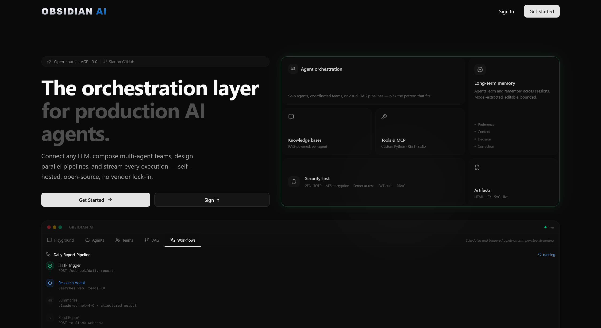

<div align="center">


### Open-Source AI Agent Management & Orchestration Platform

Build, deploy, and orchestrate AI agents, multi-agent teams, and automated workflows — all from one unified control plane. Supports OpenAI, Anthropic, Google Gemini, Ollama, OpenRouter, and any OpenAI-compatible endpoint.

[](LICENSE)
[](https://github.com/sup3rus3r/obsidian-ai/stargazers)
[](https://github.com/sup3rus3r/obsidian-ai/network/members)
[](https://github.com/sup3rus3r/obsidian-ai/issues)
[](https://www.python.org/)
[](https://nextjs.org/)
[](https://fastapi.tiangolo.com/)
[](https://react.dev/)
[](https://tailwindcss.com/)
[](https://www.sqlite.org/)
[](https://www.mongodb.com/)

---

**If you find this project useful, please consider giving it a star!** It helps others discover the project and motivates continued development.

[**Give it a Star**](https://github.com/sup3rus3r/obsidian-ai) &#11088;

</div>

---


## Table of Contents

- [Why Obsidian AI?](#why-obsidian-ai)
- [Features](#features)
  - [Multi-Provider LLM Support](#multi-provider-llm-support)
  - [Agent Builder](#agent-builder)
  - [Multi-Agent Teams](#multi-agent-teams)
  - [Workflow Automation](#workflow-automation)
  - [Real-Time Chat Playground](#real-time-chat-playground)
  - [Artifacts](#artifacts)
  - [Tool Integration](#tool-integration)
  - [Dynamic Tool Creation](#dynamic-tool-creation)
  - [MCP Protocol Support](#mcp-protocol-support)
  - [Human-in-the-Loop (HITL)](#human-in-the-loop-hitl)
  - [Knowledge Bases & RAG](#knowledge-bases--rag)
  - [Long-Term Agent Memory](#long-term-agent-memory)
  - [Agent Versioning & Rollback](#agent-versioning--rollback)
  - [Eval Harness & Regression Testing](#eval-harness--regression-testing)
  - [Prompt Auto-Optimizer](#prompt-auto-optimizer)
  - [Prompt Vault](#prompt-vault)
  - [WhatsApp Channel Integration](#whatsapp-channel-integration)
  - [Automatic Context Management](#automatic-context-management)
  - [Session History & Execution Traces](#session-history--execution-traces)
  - [Scheduled Workflows](#scheduled-workflows)
  - [Secrets Vault](#secrets-vault)
  - [Security & Authentication](#security--authentication)
  - [Admin Panel & RBAC](#admin-panel--rbac)
  - [Agent Import / Export](#agent-import--export)
  - [Docker Sandbox](#docker-sandbox)
  - [Dual Database Support](#dual-database-support)
- [Architecture](#architecture)
- [Quick Start](#quick-start)
  - [Prerequisites](#prerequisites)
  - [Backend Setup](#backend-setup)
  - [Frontend Setup](#frontend-setup)
  - [Running Both Together](#running-both-together)
  - [Environment Variables](#environment-variables)
- [Usage Guide](#usage-guide)
- [API Reference](#api-reference)
- [Tech Stack](#tech-stack)
- [Project Structure](#project-structure)
- [Updates](#updates)
- [Contributing](#contributing)
- [License](#license)

---



## Why Obsidian AI?

Most AI agent frameworks are code-only libraries that require deep programming knowledge. **Obsidian AI** provides a complete visual interface for building, managing, and running AI agents — no SDK glue code required.

- **No vendor lock-in** — Swap between OpenAI, Anthropic, Google, Ollama, or any OpenAI-compatible provider without changing a single line of agent configuration.
- **Visual orchestration** — Create multi-agent teams, sequential pipelines, and parallel DAG workflows from a drag-and-drop canvas. No YAML, no code, no boilerplate.
- **Production-ready security** — JWT auth, TOTP 2FA, AES end-to-end encryption, Fernet secrets vault, role-based access control, and rate limiting out of the box.
- **Self-hosted & open-source** — Run entirely on your own infrastructure. Your data never leaves your servers.
- **MCP-native** — First-class Model Context Protocol support for connecting external tools and services to your agents.

---

## Features

### Multi-Provider LLM Support

Connect to any major LLM provider from a single interface. Add providers with encrypted API key storage, test connections, and switch models per-agent.

| Provider | Models | Type |
|----------|--------|------|
| **OpenAI** | GPT-4.1, GPT-4.1 mini, GPT-4.1 nano, o3, o4-mini, GPT-5, GPT-5 mini | Cloud |
| **Anthropic** | Claude Opus 4.6, Claude Sonnet 4.6, Claude Haiku 4.5 | Cloud |
| **Google** | Gemini 2.5 Pro, Gemini 2.5 Flash, Gemini 3 Flash (Preview) | Cloud |
| **Ollama** | Llama, Mistral, Qwen, Phi, DeepSeek — any local model | Local |
| **OpenRouter** | Access 100+ models through one API key | Cloud |
| **Custom** | Any OpenAI-compatible endpoint (LM Studio, vLLM, etc.) | Self-hosted |

---

### Agent Builder

Create AI agents with custom system prompts, model selection, tool attachments, and MCP server connections. Each agent is fully configurable and can be used standalone or as part of a team or workflow.

- **Custom system prompts** — Define agent behavior, personality, and instructions
- **Per-agent model selection** — Pick the right model for each agent's task
- **Tool attachment** — Equip agents with HTTP, Python, or built-in tools
- **MCP server binding** — Connect agents to external services via MCP
- **Knowledge base attachment** — Assign one or more knowledge bases for persistent RAG context
- **Long-term memory** — Each agent builds a persistent memory of each user across sessions
- **Dynamic tool creation** — Enable agents to propose and create new tools mid-conversation
- **Human-in-the-loop overrides** — Define per-agent tool approval requirements independently of tool-level flags
- **Import / Export** — Share agent configurations as portable JSON files across instances

---

### Multi-Agent Teams

Combine multiple agents into coordinated teams for complex tasks. Choose from three collaboration modes that determine how agents interact.

| Mode | Description | Best For |
|------|-------------|----------|
| **Coordinate** | A lead agent delegates tasks to team members | Task decomposition, project management |
| **Route** | Messages are routed to the most appropriate agent | Customer support, multi-domain Q&A |
| **Collaborate** | Agents build on each other's responses sequentially | Research, content creation, review chains |

---

### Workflow Automation

Define multi-step workflows where each step is handled by a specific agent. Build sequential pipelines or design complex parallel graphs with the visual DAG editor. Monitor execution in real-time with per-node status tracking.

- **Visual DAG editor** — Drag-and-drop canvas (`@xyflow/react`) for building non-linear agent pipelines; connect nodes with edges, configure each node from a side-panel
- **Parallel execution** — Nodes without dependency relationships run concurrently via an async topological executor; fan-out and fan-join patterns supported natively
- **Sequential pipeline** — Chain agents in order; each step receives the previous step's output
- **Per-step agent assignment** — Use different agents (and models) for each step
- **Live run visualization** — Node colors pulse in real-time as the graph executes (gray → blue pulsing → green/red) driven by SSE events keyed by node ID
- **Cycle detection** — DFS topological sort validates the graph at save time; cyclic graphs are rejected before they can be executed
- **Layout persistence** — Node positions are stored with the workflow definition and restored when the editor re-opens
- **Run history** — Track past executions with status (pending, running, completed, failed)
- **Reusable definitions** — Save workflow templates and run them on demand or on a schedule
- **Cron scheduling** — Schedule workflows to run automatically using standard cron expressions

---

### Real-Time Chat Playground

A full-featured chat interface for interacting with agents, teams, and workflows. Powered by Server-Sent Events (SSE) for real-time streaming.

- **Live streaming responses** — Token-by-token output via SSE
- **Tool execution visualization** — See tool calls, parameters, and results inline
- **Chain-of-thought reasoning** — View agent thinking steps for supported models
- **File attachments** — Send images, PDFs, Word docs, markdown, and text files directly in chat
- **Prompt suggestions** — Quick-start prompts to get conversations going
- **Markdown rendering** — GitHub-flavored markdown with syntax highlighting (Shiki), math (KaTeX), and Mermaid diagrams
- **Agentic tool loops** — Agents can execute up to 10 rounds of tool calls per response

---

### Artifacts

When an agent produces substantial standalone content — an HTML page, a code file, an SVG diagram, a JSON payload — it wraps it in a named **artifact** instead of a code block. Artifacts open in a persistent side panel alongside the chat.

- **Rich preview** — HTML, JSX, TSX, SVG, and CSS artifacts render live in a sandboxed iframe
- **Syntax highlighting** — Code view uses Shiki (github-dark theme) for all supported languages
- **In-panel editing** — Switch to Edit mode to modify artifact content directly; changes reflect instantly in the preview
- **Multiple artifacts** — Each session can accumulate multiple artifacts shown as tabs in the panel
- **Copy & download** — One-click copy to clipboard or download with the correct file extension
- **Fullscreen mode** — Expand the artifact panel to fill the entire screen
- **Inline reference chips** — Each artifact appears as a clickable chip in the chat message; the raw XML tag is never shown to the user
- **Live streaming** — The panel opens as soon as the agent starts writing an artifact; an animated tab shows the title while it's being written
- **In-place editing** — When the agent modifies an existing artifact, the tab updates in place rather than opening a new one

**Artifact tag format:**

```
<artifact id="unique_snake_case_id" title="Human-readable title" type="html|jsx|tsx|css|javascript|typescript|python|markdown|json|svg|text">
...content...
</artifact>
```

---

### Tool Integration

Equip agents with tools using pre-built templates or custom definitions. Tools are defined with JSON Schema parameters and can call external APIs, run Python code, or use built-in functions.

| Template | Description |
|----------|-------------|
| **Weather Lookup** | Get current weather for any location |
| **Calculator** | Evaluate mathematical expressions |
| **Web Search** | Search the web for information |
| **Date & Time** | Get the current date and time |
| **API Request** | Call any external REST API endpoint |
| **Custom Python** | Write your own Python handler function |
| **Blank Tool** | Define a tool from scratch with full JSON Schema |

---

### Dynamic Tool Creation

Agents can propose and create new tools mid-conversation — no pre-configuration needed. Enable the **Allow Tool Creation** toggle on any agent, then ask it to build a capability it doesn't have. The agent designs the tool, and a review card appears inline in the chat.

- **Opt-in per agent** — Only agents with the toggle enabled can propose tools
- **Two handler types** — Pure-Python (stdlib only) or HTTP REST endpoint
- **Inline review card** — Shows tool name, description, handler type, collapsible parameter schema and code
- **Immediate availability** — Approved tools are usable by the agent in the same session without a page reload
- **Sidebar auto-refresh** — The tools list updates silently on approval with no disruption to the active chat
- **Safety timeout** — Proposals are auto-rejected after 10 minutes if left unreviewed

---

### MCP Protocol Support

Connect external services via the [Model Context Protocol](https://modelcontextprotocol.io/). MCP servers expose tools that agents can discover and use during conversations.

- **Stdio transport** — Run local MCP servers as child processes (Docker, npx, Python, etc.)
- **SSE transport** — Connect to remote MCP servers over HTTP
- **Connection testing** — Verify server connectivity and discover available tools before saving
- **Environment variables** — Pass API keys and configuration to MCP servers securely
- **Per-agent binding** — Attach specific MCP servers to specific agents

---

### Human-in-the-Loop (HITL)

Pause agent execution before sensitive tool calls and require explicit human approval before proceeding. The agent's streaming generator suspends at the flagged tool, surfaces an approval card in the chat, and only resumes based on the user's decision.

- **Tool-level flag** — Enable "Requires human approval" on any tool via the tool creation dialog
- **Agent-level overrides** — Independently mark tool names in the agent's "Require Approval For" list — triggers HITL even when the tool-level flag is off
- **MCP tool support** — MCP tools can also be flagged via the agent override list
- **Inline approval card** — An amber shield card appears in the streaming message with the tool name, formatted arguments, and Approve / Deny buttons
- **Reconnect safe** — Pending approvals are persisted to the database; reloading the page re-fetches and re-renders the card
- **Auto-deny on timeout** — Approvals left unanswered for 10 minutes are automatically denied
- **Server restart recovery** — All stale pending approvals are auto-denied on startup
- **Zero-polling** — Uses `asyncio.Event` to suspend the generator; the approve/reject HTTP request sets the event, resuming execution with zero busy-waiting

---

### Knowledge Bases & RAG

Persistent, reusable knowledge bases that can be attached to agents for retrieval-augmented generation. Unlike session-level file attachments, knowledge bases are indexed once and searched on every message.

**Knowledge Bases:**

- **Two document types** — Paste text directly, or upload files (PDF, DOCX, TXT, Markdown)
- **Automatic indexing** — Content is chunked and embedded into a FAISS vector store on upload
- **Per-agent attachment** — Assign one or more knowledge bases to an agent from the agent dialog
- **Shared KBs** — Admins can create shared knowledge bases visible to all users
- **Chat indicators** — A pill badge in the chat bubble shows which KB was used for each response

**Session-Level File Attachments:**

- **Supported formats** — PNG, JPG, GIF, WebP, PDF, Word (.docx), Markdown, plain text
- **Automatic chunking** — Documents are split and indexed for vector search
- **Per-session indexes** — Each conversation gets its own isolated vector store
- **Cross-platform** — FAISS on Windows, Leann HNSW on Linux/macOS

---

### Long-Term Agent Memory

Agents remember what matters across conversations. At the start of each new session, a background LLM reflection call distills the previous session into a compact set of durable facts — preferences, project context, decisions, and corrections — which are automatically injected into every future system prompt.

- **Model-driven extraction** — The agent's own LLM decides what to remember; no keyword rules or manual tagging required
- **Four memory categories** — `preference` (how the user likes things), `context` (project/background info), `decision` (agreed-upon choices), `correction` (feedback on agent behaviour)
- **Zero-latency trigger** — Reflection runs as a background task on the first message of a new session; the user's response is never delayed
- **Bounded storage** — Maximum 50 memories per agent/user pair; oldest low-confidence facts are evicted automatically when the cap is reached
- **Key-based deduplication** — If a new fact contradicts an existing memory, it replaces the old one rather than accumulating stale data
- **Transparent & editable** — Open any agent in edit mode to see all stored memories with category colour-coding; delete individual facts or clear everything with one click
- **Persistent across restarts** — Memories are stored in the database (`agent_memories` table / MongoDB collection)

---

### Agent Versioning & Rollback

Every time an agent's configuration is saved, the previous version is automatically snapshotted. Browse the full history, inspect diffs, and restore any past configuration — all without ever losing your work.

- **Auto-snapshot on save** — A full config snapshot is taken before every update with zero extra clicks
- **Version history panel** — Expand the "Version History" section in any agent's edit dialog to see a list of all past versions with timestamps and change summaries
- **Side-by-side diff view** — Click any version to open a two-column diff comparing it to the previous snapshot
- **One-click rollback** — Restore a previous version; the rollback itself is also versioned so you can undo it too
- **Safe iteration** — Underpins the Prompt Auto-Optimizer and eval-driven changes; every prompt change is reversible
- **Automatic pruning** — Versions older than 72 hours are pruned daily (the most recent version is always kept)

---

### Eval Harness & Regression Testing

Define test suites with expected inputs and outputs, run them against any agent configuration, and get scored pass/fail results. Catch quality regressions before they reach users.

- **Test suite builder** — Create named suites with as many test cases as needed; each case has an input, expected output, and a grading method
- **Three grading methods** — `exact_match` (string equality), `contains` (substring check), `llm_judge` (a secondary LLM call scores the response and explains its reasoning)
- **Run against any config** — Trigger a run from the Evals page; results are stored and browsable per suite
- **Live results view** — Expand each test case to see the actual output, expected output, pass/fail badge, and LLM judge reasoning where applicable
- **Agent-level run history** — See all eval runs across suites for a given agent
- **Optimizer integration** — The Prompt Auto-Optimizer uses eval suites to validate proposed prompt changes before surfacing them for review

**New API endpoints:**

| Endpoint | Method | Description |
|----------|--------|-------------|
| `/evals/suites` | GET / POST | List or create eval suites |
| `/evals/suites/{id}` | GET / PUT / DELETE | Get, update, or delete a suite |
| `/evals/suites/{id}/run` | POST | Trigger an eval run (background) |
| `/evals/runs/{id}` | GET / DELETE | Get or delete an eval run |
| `/evals/suites/{id}/runs` | GET | List all runs for a suite |
| `/evals/agents/{id}/runs` | GET | List all eval runs for an agent |

---

### Prompt Auto-Optimizer

Automatically analyzes an agent's recent conversation history, identifies recurring failure patterns, and proposes an improved system prompt — with optional validation against an eval suite before you see it.

- **Trace-driven analysis** — The optimizer collects recent sessions and passes them to an LLM that identifies where the agent underperformed, misunderstood users, or violated its instructions
- **Failure pattern extraction** — Patterns are categorized by severity (low / medium / high) and displayed as labeled chips so you can see exactly what was wrong
- **Prompt proposal** — A second LLM call rewrites the system prompt to address the identified patterns while preserving the agent's existing capabilities
- **Eval validation** — Optionally select an eval suite; the optimizer runs the current and proposed prompts through the suite and shows a before/after score (e.g. baseline 60% → proposed 85%)
- **Side-by-side diff view** — The current and proposed prompts are shown side-by-side in a fixed-width monospace panel for easy comparison
- **Accept or reject** — Accepting applies the proposed prompt to the agent (and creates a version snapshot first for safety); rejecting discards it with an optional reason
- **Past runs list** — All previous optimization runs are listed below the active run panel for reference
- **Weekly auto-sweep** — APScheduler triggers the optimizer automatically every Monday at 02:00 for all agents that have enough recent traces (configurable minimum)
- **Requires ≥ 5 sessions** — The optimizer needs enough conversation data to identify meaningful patterns; running it on a fresh agent will report "not enough traces"

**New API endpoints:**

| Endpoint | Method | Description |
|----------|--------|-------------|
| `/optimizer/trigger` | POST | Start a new optimization run |
| `/optimizer/agents/{id}` | GET | List optimization runs for an agent |
| `/optimizer/runs/{id}` | GET | Poll run status |
| `/optimizer/runs/{id}/accept` | POST | Accept the proposed prompt |
| `/optimizer/runs/{id}/reject` | POST | Reject the proposed prompt |
| `/optimizer/runs/{id}` | DELETE | Delete a run record |

---

### Prompt Vault

A library for storing and reusing system prompts across agents. Save prompts manually, or push proposed prompts directly from the Prompt Auto-Optimizer without leaving the review flow.

- **Vault page** — Browse, create, edit, and delete saved prompts from a dedicated settings page
- **Optimizer integration** — Accept an optimizer-proposed prompt directly into the vault (as a new entry or as an update to an existing one) alongside or instead of applying it to the agent
- **Full CRUD** — Each entry has a name, description, and prompt body
- **Both databases** — Works identically with SQLite and MongoDB

---

### WhatsApp Channel Integration

Connect any agent to a WhatsApp account via QR code scan. No Meta Business account, no API fees, no webhooks required.

- **QR pairing** — Click Connect, scan the QR code with WhatsApp → Linked Devices, and the channel goes live
- **Per-channel agent** — Route all messages on a channel to a specific agent; change the agent at any time without re-scanning
- **Contact whitelist** — Restrict which contacts the agent responds to; others receive a custom rejection message or are silently ignored
- **Session continuity** — Each `(channel, contact)` pair maps to a persistent session; the agent remembers conversation history and applies long-term memory
- **Voice note transcription** — Incoming voice notes are transcribed locally using [faster-whisper](https://github.com/SYSTRAN/faster-whisper) (CPU, no cloud STT)
- **Voice note replies** — Reply with synthesised audio using the multi-backend TTS pipeline (see [Voice Reply Setup](#voice-reply-setup-optional)):
  - **Qwen3-TTS** (GPU): 9 preset voices across English, Chinese, Japanese, Korean; or reply in the user's own cloned voice
  - **Pocket TTS** (CPU fallback): 8 voices, CPU-native
  - **Kokoro** (last resort): lightweight CPU fallback
- **Voice cloning** — Record or upload a voice sample in the channel settings page; the agent replies in the user's voice. Includes a guided in-browser recorder with a phonetically rich script
- **Per-channel TTS engine** — Choose `auto`, `qwen`, or `classic` per channel
- **HITL in channels** — Pending approvals surface in the global notification badge in the top bar
- **Auto-reconnect** — The sidecar reconnects all authenticated channels automatically on startup

---

### Automatic Context Management

When a conversation approaches a model's context limit, the platform automatically compresses older history so sessions can continue indefinitely without hitting token limits or requiring manual intervention.

- **Threshold-based trigger** — Compaction activates at 80% of the model's context window
- **Recent messages preserved** — The last 10 messages are always kept verbatim for continuity
- **LLM-driven summarization** — Older messages are summarized by the same LLM into a single compact summary message that replaces them
- **Transparent notification** — A `context_compacted` event is streamed to the frontend when compaction occurs
- **Audit trail** — Each compaction is recorded in the database with metadata about what was compressed
- **Model-aware limits** — Context limits are tracked per model family (Claude 200k, GPT-4 128k, etc.) with a safe fallback for unknown models

---

### Session History & Execution Traces

Browse, search, and manage past conversations. Sessions are organized by agent or team and can be filtered by type.

**Session History:**

- **Search** — Find conversations by content
- **Filter by type** — View agent, team, or workflow sessions
- **Resume conversations** — Click a session to continue where you left off
- **Delete sessions** — Remove conversations you no longer need

**Execution Traces:**

Every agent session and scheduled workflow run records a full execution trace — a sequence of spans capturing each LLM call and tool/MCP call with timing, token usage, and input/output previews.

- **Span types** — LLM calls (Brain icon), tool calls (Wrench), MCP calls (Server), workflow steps (GitBranch)
- **Round grouping** — Spans are grouped by tool-loop iteration ("Initial", "Round 1", "Round 2" ...)
- **Collapsible details** — Each span reveals input/output JSON previews (truncated at 500 chars)
- **Performance indicators** — Duration badge turns amber for spans taking > 5s; error indicator on failed spans
- **Token summary** — Total duration, total tokens, and span count shown in the trace header
- **Access** — Hover any session row in `/sessions` and click the Activity icon

---

### Scheduled Workflows

Run workflows automatically on a server-side cron schedule — no browser required. Scheduled runs are identical to manual runs: a `WorkflowRun` record is created, each step executes sequentially, and results appear in the workflow's run history.

- **Cron expressions** — Standard 5-field cron syntax (`minute hour day month weekday`) with a helper link to [crontab.guru](https://crontab.guru)
- **Fixed input text** — Optionally supply the input text that feeds into the first workflow step at schedule creation time
- **Active / paused toggle** — Pause and resume schedules without deleting them
- **Missed-run skipping** — If the server is down during a scheduled run, the missed run is skipped rather than queued
- **Restart persistence** — Active schedules are automatically re-registered when the server starts up
- **Per-user ownership** — Each user manages their own schedules; they are not visible to other users
- **Run history** — Each scheduled execution appears alongside manual runs in the workflow history dialog

---

### Secrets Vault

Store API keys, tokens, and sensitive credentials in an encrypted vault. Secrets are encrypted at rest and can be referenced when configuring providers — no need to paste raw API keys.

- **Fernet encryption at rest** — All secret values are encrypted before storage
- **AES encryption in transit** — Secrets are transmitted via encrypted payloads
- **Reference in providers** — Use stored secrets when adding LLM providers instead of entering keys directly
- **CRUD management** — Create, view, update, and delete secrets from the settings page

---

### Security & Authentication

Enterprise-grade security features built in from day one.

| Feature | Implementation |
|---------|---------------|
| **JWT Authentication** | HS256 signed tokens with configurable expiry |
| **Two-Factor Auth (2FA)** | TOTP-based with QR code enrollment (Google Authenticator, Authy) |
| **End-to-End Encryption** | AES-encrypted request payloads (CryptoJS client, PyCryptodome server) |
| **Secrets at Rest** | Fernet-encrypted storage for API keys and credentials |
| **Password Hashing** | Bcrypt with salt for all user passwords |
| **Rate Limiting** | Per-endpoint limits via SlowAPI (configurable per user and API client) |
| **API Client Credentials** | Generate client ID/secret pairs for programmatic access |

---

### Admin Panel & RBAC

Manage users, assign roles, and control permissions with a granular role-based access control system.

- **Admin & Guest roles** — Two built-in roles with configurable permissions
- **Six permission flags** — Create Agents, Create Teams, Create Workflows, Create Tools, Manage Providers, Manage MCP Servers
- **User management** — Create, edit, and delete user accounts
- **Statistics dashboard** — View total users, admin count, and guest count

---

### Agent Import / Export

Share agent configurations as portable JSON files across any Obsidian AI instance. The export resolves all internal IDs to human-readable names so the file is fully self-contained and shareable. On import, names are matched back to the importing user's resources; any that don't exist are skipped and reported as warnings.

**Export file format:**

```json
{
  "aios_export_version": "1",
  "exported_at": "2026-01-01T00:00:00Z",
  "agent": {
    "name": "Research Assistant",
    "description": "Searches the web for information",
    "system_prompt": "You are a research assistant...",
    "provider_model_id": "gpt-4o",
    "tools": ["web_search", "calculator"],
    "mcp_servers": ["brave-search"],
    "knowledge_bases": ["Company Docs"],
    "hitl_confirmation_tools": ["delete_file"],
    "config": { "temperature": 0.7, "max_tokens": 2000 }
  }
}
```

---

### Docker Sandbox

Give any agent or team an isolated Docker container for safe code execution and file operations. When sandbox is enabled, the agent gains a set of built-in tools to interact with the container and automatically surfaces any files it creates as artifacts in the chat panel.

- **Per-agent and per-team** — Enable sandbox independently on individual agents or entire teams; all agents in a sandboxed team share the same container
- **Isolated container** — Each sandbox runs the `obsidian-webdev-base` image with a 512 MB memory cap, 1 CPU limit, and `/workspace` as the working directory
- **Start / stop controls** — Launch or terminate the container directly from the agent or team edit dialog; a pulsing status dot shows whether the container is live
- **Sandbox status badge** — A live indicator appears in the chat header whenever a sandbox-enabled agent or team has an active container
- **Built-in sandbox tools** — When an active sandbox container is detected, nine tools are automatically injected into the agent's tool set:

| Tool | Description |
|------|-------------|
| `sandbox_bash` | Run any shell command inside the container |
| `sandbox_write` | Write content to a file (creates parent directories automatically) |
| `sandbox_read` | Read a file's contents back from the container |
| `sandbox_ls` | List files and directories |
| `sandbox_glob` | Find files matching a shell glob pattern |
| `sandbox_grep` | Search file contents with regex |
| `sandbox_delete` | Delete a file or directory |
| `sandbox_python` | Execute Python 3.12 code and return output (numpy, pandas, matplotlib, scikit-learn, requests, httpx, pytest pre-installed) |
| `sandbox_node` | Execute JavaScript (Node.js 20) or TypeScript (ts-node) code and return output |

- **Automatic artifact surfacing** — The agent is instructed via system prompt to call `sandbox_read` after creating or modifying any file and wrap the result in an `<artifact>` tag, so files appear in the artifact panel with live preview, copy, and download

---

### Dual Database Support

Run with zero-config SQLite out of the box, or switch to MongoDB for production deployments. Every endpoint supports both databases with automatic branching.

| Database | Config | Use Case |
|----------|--------|----------|
| **SQLite** | Default — no setup required | Development, single-user, small teams |
| **MongoDB** | Set `DATABASE_TYPE=mongo` | Production, multi-user, horizontal scaling |

---

## Architecture

```
┌──────────────────────────────┐       ┌──────────────────────────────┐
│         Frontend             │       │          Backend             │
│    Next.js 16 + React 19     │──────>│     FastAPI + SQLAlchemy     │
│    Port 3000                 │ /api  │     Port 8000                │
│                              │proxy  │                              │
│  ┌────────┐ ┌─────────────┐ │       │  ┌──────────┐ ┌───────────┐ │
│  │NextAuth│ │ Zustand      │ │       │  │ JWT Auth │ │ LLM       │ │
│  │  v5    │ │ State Mgmt   │ │       │  │ + 2FA    │ │ Providers │ │
│  └────────┘ └─────────────┘ │       │  └──────────┘ └───────────┘ │
│  ┌────────┐ ┌─────────────┐ │       │  ┌──────────┐ ┌───────────┐ │
│  │Radix UI│ │ CryptoJS    │ │       │  │ MCP      │ │ RAG       │ │
│  │/shadcn │ │ Encryption  │ │       │  │ Client   │ │ Service   │ │
│  └────────┘ └─────────────┘ │       │  └──────────┘ └───────────┘ │
└──────────────────────────────┘       └──────────┬───────────────────┘
                                                  │
                                       ┌──────────▼───────────────────┐
                                       │   SQLite (default) / MongoDB │
                                       └──────────────────────────────┘
```

**How it works:**

1. The Next.js frontend proxies all `/api/*` requests to the FastAPI backend via `next.config.ts` rewrites
2. Authentication flows through NextAuth v5 on the frontend and JWT verification on the backend
3. All auth-sensitive payloads are AES-encrypted end-to-end (CryptoJS client-side, PyCryptodome server-side)
4. Chat responses stream via Server-Sent Events (SSE) for real-time token delivery
5. LLM providers are abstracted behind a factory pattern — agents reference a provider, not a specific SDK

---

## Quick Start

### Prerequisites

| Tool | Version | Purpose |
|------|---------|---------|
| [Python](https://www.python.org/) | 3.12+ | Backend runtime |
| [Node.js](https://nodejs.org/) | 18+ | Frontend runtime |
| [uv](https://docs.astral.sh/uv/) | Latest | Python package manager |
| [npm](https://www.npmjs.com/) | 9+ | Node package manager |

### Backend Setup

```bash
# Navigate to the backend directory
cd backend

# Install Python dependencies
uv sync

# Configure environment variables (see Environment Variables section)
# Edit .env with your keys

# Start the FastAPI development server
uv run uvicorn main:app --reload
```

The backend API will be available at `http://localhost:8000`. Interactive docs at `http://localhost:8000/docs`.

### Frontend Setup

```bash
# Navigate to the frontend directory
cd frontend

# Install Node.js dependencies
npm install

# Configure environment variables
# Edit .env.local with your keys

# Start the Next.js development server
npm run dev
```

The frontend will be available at `http://localhost:3000`.

### WhatsApp Bridge Setup

```bash
# Navigate to the wa-bridge directory
cd wa-bridge

# Install Node.js dependencies
npm install

# Start the WhatsApp bridge
node index.js
```

The WhatsApp bridge will be available at `http://localhost:3200`.

### Voice Reply Setup (Optional)

WhatsApp channels support AI-generated voice note replies. This is **optional** — text replies work without it.

**System requirement: ffmpeg**

ffmpeg is required to convert synthesised audio to OGG Opus (the native WhatsApp voice note format). Install it and ensure it is on your system PATH:

```bash
# Windows
winget install ffmpeg

# macOS
brew install ffmpeg

# Ubuntu / Debian
sudo apt update && sudo apt install -y ffmpeg

# Fedora / RHEL
sudo dnf install ffmpeg

# Arch Linux
sudo pacman -S ffmpeg
```

> Restart the backend after installing ffmpeg so the new PATH is picked up.

**TTS engine selection**

The platform supports three TTS backends selected per channel or globally via the `tts_backend` setting:

| Setting | Engine | Requirement | Quality |
|---------|--------|-------------|---------|
| `auto` (default) | Qwen3-TTS on GPU, Pocket TTS on CPU | CUDA GPU for Qwen3 | High (GPU) / Good (CPU) |
| `qwen` | Qwen3-TTS forced | CUDA GPU + `pip install qwen-tts` | High |
| `classic` | Pocket TTS → Kokoro | CPU only | Good |

**Qwen3-TTS (GPU, high quality)**

[Qwen3-TTS](https://huggingface.co/Qwen/Qwen3-TTS) is a high-quality neural TTS model from Alibaba. It requires a CUDA GPU and is auto-selected when one is available.

```bash
pip install qwen-tts
```

> **Important:** PyPI only ships the CPU build of PyTorch. Qwen3-TTS requires a CUDA-enabled build. After `uv sync`, install the CUDA PyTorch wheel manually:
>
> ```bash
> # Check your CUDA version first: nvidia-smi
> # Then install the matching wheel (replace cu121 with cu118 or cu124 as needed):
> uv pip install torch torchvision torchaudio --index-url https://download.pytorch.org/whl/cu121
> ```
>
> Verify CUDA is available: `python -c "import torch; print(torch.cuda.is_available())"`

Preset voices available: `Ryan`, `Aiden` (English), `Vivian`, `Serena`, `Uncle_Fu`, `Dylan`, `Eric` (Chinese), `Ono_Anna` (Japanese), `Sohee` (Korean).

Configure model size and device via environment variables:

```env
QWEN_TTS_SIZE=0.6B     # or 1.7B for higher quality (uses more VRAM)
QWEN_TTS_DEVICE=cuda:0
```

**Voice cloning**

When Qwen3-TTS is active, users can record or upload a short voice sample (3 seconds minimum) directly in the channel settings page. The agent will reply in the user's own voice. A guided recording script is provided in the UI for best results. Voice clone prompts are cached in memory — the reference audio is only processed once per session.

```env
VOICE_SAMPLES_DIR=voice_samples   # Directory where uploaded voice samples are stored
```

**Pocket TTS / Kokoro (CPU fallback)**

If Qwen3-TTS is unavailable (no GPU or `qwen-tts` not installed), the system falls back to [Pocket TTS](https://github.com/kyutai-labs/pocket-tts) (~471MB, CPU-native, ~3× faster than real-time), then to [Kokoro](https://github.com/hexgrad/kokoro) if Pocket TTS also fails. Models are downloaded automatically from HuggingFace on first use. If all TTS backends fail, the reply is sent as text.

**SoX (Optional)**

[SoX](https://sox.sourceforge.net/) is used internally by Pocket TTS for audio processing. It is only needed when running in `classic` mode — if you have a CUDA GPU and Qwen3-TTS is active, SoX is not required.

```bash
# Windows
winget install sox

# macOS
brew install sox

# Ubuntu / Debian
sudo apt install sox

# Fedora / RHEL
sudo dnf install sox

# Arch Linux
sudo pacman -S sox
```

**Flash Attention (Optional)**

[Flash Attention 2](https://github.com/Dao-AILab/flash-attention) speeds up transformer attention computation for Qwen3-TTS on CUDA GPUs. Without it, the system falls back to standard PyTorch attention — output is identical, just slower.

```bash
uv pip install flash-attn
```

> Requires a compatible CUDA GPU and takes a while to compile.

### Docker Sandbox Base Image

If you plan to use the Docker Sandbox feature, build the base image once before starting agents with sandbox enabled:

```bash
docker build -f backend/Dockerfile.base -t obsidian-webdev-base:latest backend/
```

This image includes Python 3.12, Node.js 20, and common dev tools. It only needs to be rebuilt if you modify `backend/Dockerfile.base`.

### Running Both Together

```bash
# From the project root directory
npm run dev
```

This starts both the frontend and backend concurrently.

### Environment Variables

#### Backend (`backend/.env`)

> **Important:** You must generate real secret keys before starting the backend. Placeholder values will cause startup errors.

```bash
# Generate ENCRYPTION_KEY and JWT_SECRET_KEY (any random string works):
openssl rand -hex 32

# Generate PROVIDER_KEY_SECRET (must be a valid Fernet key — 32 url-safe base64-encoded bytes):
python -c "from cryptography.fernet import Fernet; print(Fernet.generate_key().decode())"
```

```env
# Encryption key for AES payload encryption (must match frontend NEXT_PUBLIC_ENCRYPTION_KEY)
ENCRYPTION_KEY=<output of: openssl rand -hex 32>

# JWT authentication
JWT_SECRET_KEY=<output of: openssl rand -hex 32>
JWT_ALGORITHM=HS256
JWT_ACCESS_TOKEN_EXPIRE_MINUTES=30

# Fernet key for encrypting provider API keys at rest (MUST be a valid Fernet key)
PROVIDER_KEY_SECRET=<output of: python -c "from cryptography.fernet import Fernet; print(Fernet.generate_key().decode())">

# Rate limiting (requests per minute)
RATE_LIMIT_USER=60
RATE_LIMIT_API_CLIENT=100

# Database type: "sqlite" (default) or "mongo"
DATABASE_TYPE=sqlite

# Tavily Search API key — required for the web_search agent tool
# Get a free key (1000 searches/month) at https://app.tavily.com
TAVILY_API_KEY=tvly-...

# WhatsApp bridge URL (default: http://localhost:3200)
WA_BRIDGE_URL=http://localhost:3200

# TTS — Qwen3-TTS settings (GPU only; ignored if qwen-tts not installed)
QWEN_TTS_SIZE=0.6B          # or 1.7B for higher quality
QWEN_TTS_DEVICE=cuda:0
VOICE_SAMPLES_DIR=voice_samples
```

#### Frontend (`frontend/.env.local`)

```env
# NextAuth.js signing secret
AUTH_SECRET=your-auth-secret

# Application URL
AUTH_URL=http://localhost:3000

# Public encryption key (must match backend ENCRYPTION_KEY)
NEXT_PUBLIC_ENCRYPTION_KEY=your-encryption-key
```

---

## Usage Guide

### 1. Add an LLM Provider

Navigate to the **Chat** page sidebar and click **+** next to Endpoints. Select a provider type (OpenAI, Anthropic, Google, Ollama, etc.), enter your API key or reference one from the secrets vault, and specify the model ID.

### 2. Create an Agent

Click **+** next to Agents in the sidebar. Configure the agent with a name, system prompt, and model/provider selection. Optionally attach tools, MCP servers, and knowledge bases.

### 3. Start Chatting

Select your agent from the sidebar and start a conversation. Responses stream in real-time. Attach files, view tool executions, and explore chain-of-thought reasoning.

### 4. Build a Team

Switch to the **Teams** tab, click **+**, and combine multiple agents. Choose a coordination mode (Coordinate, Route, or Collaborate) and start a team chat.

### 5. Create a Workflow

From the **Dashboard**, click **Create Workflow**. Add sequential steps, each assigned to a specific agent with custom instructions. Run the workflow and watch each step execute in real-time.

### 6. Configure MCP Servers

In the sidebar, click **+** next to MCP Servers. Set up servers using stdio (local Docker/npx/python) or SSE (remote HTTP) transport. Test the connection to discover available tools, then bind servers to agents.

### 7. Manage Secrets

Go to **Settings > Secrets** to store API keys and tokens in the encrypted vault. Reference stored secrets when adding LLM providers.

### 8. Enable Two-Factor Authentication

In **Settings**, enable 2FA by scanning the QR code with an authenticator app (Google Authenticator, Authy, etc.). Enter the 6-digit code to verify setup.

### 9. Manage Users (Admin)

Navigate to the **Admin** panel to create users, assign roles (Admin/Guest), and configure granular resource permissions.

---

## API Reference

The backend exposes a RESTful API with interactive documentation:

- **Swagger UI** — `http://localhost:8000/docs`
- **ReDoc** — `http://localhost:8000/redoc`

### Key Endpoints

| Category | Endpoint | Method | Description |
|----------|----------|--------|-------------|
| **Auth** | `/auth/register` | POST | Create a new user account |
| **Auth** | `/auth/login` | POST | Authenticate and receive JWT token |
| **Agents** | `/agents` | GET | List all agents |
| **Agents** | `/agents` | POST | Create a new agent |
| **Agents** | `/agents/{id}` | PUT | Update an agent |
| **Agents** | `/agents/{id}` | DELETE | Delete an agent |
| **Agents** | `/agents/{id}/export` | GET | Export agent as JSON |
| **Agents** | `/agents/import` | POST | Import agent from JSON |
| **Teams** | `/teams` | GET | List all teams |
| **Teams** | `/teams` | POST | Create a new team |
| **Workflows** | `/workflows` | GET | List all workflows |
| **Workflows** | `/workflows` | POST | Create a new workflow |
| **Workflows** | `/workflows/{id}/run` | POST | Execute a workflow (SSE) |
| **Workflows** | `/workflows/{id}/runs` | GET | List workflow run history |
| **Schedules** | `/workflows/{id}/schedules` | GET | List schedules for a workflow |
| **Schedules** | `/workflows/{id}/schedules` | POST | Create a cron schedule |
| **Schedules** | `/schedules/{id}` | PUT | Update a schedule |
| **Schedules** | `/schedules/{id}` | DELETE | Delete a schedule |
| **Chat** | `/chat` | POST | Stream a chat response (SSE) |
| **Sessions** | `/sessions` | GET | List conversation sessions |
| **Sessions** | `/sessions/{id}/messages` | GET | Get session messages |
| **Traces** | `/traces/sessions/{id}` | GET | Get full execution trace for a session |
| **Traces** | `/traces/workflow-runs/{id}` | GET | Get execution trace for a workflow run |
| **Providers** | `/providers` | GET | List configured LLM providers |
| **Providers** | `/providers/{id}/test` | POST | Test provider connection |
| **Providers** | `/providers/{id}/models` | GET | List available models |
| **Tools** | `/tools` | GET | List available tool definitions |
| **Tools** | `/tools` | POST | Create a tool definition |
| **MCP** | `/mcp-servers` | GET | List MCP server configurations |
| **MCP** | `/mcp-servers/{id}/test` | POST | Test MCP server connection |
| **Knowledge** | `/knowledge` | GET | List knowledge bases |
| **Knowledge** | `/knowledge/{id}/documents` | POST | Add a document to a knowledge base |
| **Memory** | `/memory/agents/{id}` | GET | List agent memories |
| **Memory** | `/memory/agents/{id}` | DELETE | Clear all agent memories |
| **Versions** | `/versions/agents/{id}` | GET | List agent version snapshots |
| **Versions** | `/versions/agents/{id}/{vid}/rollback` | POST | Rollback to a version |
| **Evals** | `/evals/suites` | GET / POST | List or create eval suites |
| **Evals** | `/evals/suites/{id}/run` | POST | Trigger an eval run |
| **Evals** | `/evals/runs/{id}` | GET | Poll eval run status |
| **Evals** | `/evals/agents/{id}/runs` | GET | List eval runs for an agent |
| **Optimizer** | `/optimizer/trigger` | POST | Start a new optimization run |
| **Optimizer** | `/optimizer/agents/{id}` | GET | List optimization runs for an agent |
| **Optimizer** | `/optimizer/runs/{id}` | GET | Poll optimization run status |
| **Optimizer** | `/optimizer/runs/{id}/accept` | POST | Accept the proposed prompt |
| **Optimizer** | `/optimizer/runs/{id}/reject` | POST | Reject the proposed prompt |
| **Secrets** | `/secrets` | GET | List user secrets (encrypted) |
| **Secrets** | `/secrets` | POST | Create a new secret |
| **Files** | `/files/upload` | POST | Upload a file attachment |
| **Dashboard** | `/dashboard/stats` | GET | Get dashboard statistics |
| **Admin** | `/admin/users` | GET | List all users (admin only) |
| **Admin** | `/admin/users` | POST | Create a user (admin only) |
| **Admin** | `/admin/users/{id}` | PUT | Update user role/permissions |
| **User** | `/user/2fa/setup` | POST | Set up TOTP two-factor auth |
| **User** | `/user/2fa/verify` | POST | Verify 2FA setup |
| **User** | `/user/api-clients` | POST | Generate API client credentials |
| **WhatsApp** | `/wa/channels` | GET / POST | List or create WhatsApp channels |
| **WhatsApp** | `/wa/channels/{id}` | GET / PATCH / DELETE | Get, update, or delete a channel |
| **WhatsApp** | `/wa/channels/{id}/connect` | POST | Initiate QR pairing |
| **WhatsApp** | `/wa/channels/{id}/disconnect` | POST | Disconnect session |
| **WhatsApp** | `/wa/channels/{id}/qr` | GET (SSE) | Stream QR code and connected event |
| **WhatsApp** | `/wa/channels/{id}/voice-sample` | POST / DELETE | Upload or remove voice clone sample |
| **Prompt Vault** | `/prompt-vault` | GET / POST | List or create saved prompts |
| **Prompt Vault** | `/prompt-vault/{id}` | GET / PUT / DELETE | Get, update, or delete a prompt |
| **Health** | `/health` | GET | Health check |

### Programmatic Access

Generate API client credentials from **Settings** to access the API programmatically:

```bash
curl -H "X-API-Key: your-client-id" \
     -H "X-API-Secret: your-client-secret" \
     http://localhost:8000/agents
```

---

## Tech Stack

### Frontend

| Technology | Purpose |
|------------|---------|
| [Next.js 16](https://nextjs.org/) | React framework with App Router |
| [React 19](https://react.dev/) | UI component library |
| [NextAuth v5](https://authjs.dev/) | Authentication & session management |
| [Tailwind CSS 4](https://tailwindcss.com/) | Utility-first styling |
| [Radix UI](https://www.radix-ui.com/) / [shadcn/ui](https://ui.shadcn.com/) | Accessible component primitives |
| [Zustand](https://zustand.docs.pmnd.rs/) | Lightweight state management |
| [CryptoJS](https://github.com/brix/crypto-js) | Client-side AES encryption |
| [Lucide React](https://lucide.dev/) | Icon library |
| [Motion](https://motion.dev/) | Animation library |
| [Shiki](https://shiki.style/) | Syntax highlighting |
| [Sonner](https://sonner.emilkowal.dev/) | Toast notifications |

### Backend

| Technology | Purpose |
|------------|---------|
| [FastAPI](https://fastapi.tiangolo.com/) | Async Python web framework |
| [SQLAlchemy](https://www.sqlalchemy.org/) | SQL ORM (SQLite) |
| [Motor](https://motor.readthedocs.io/) | Async MongoDB driver |
| [Pydantic](https://docs.pydantic.dev/) | Data validation & serialization |
| [python-jose](https://github.com/mpdavis/python-jose) | JWT token handling |
| [bcrypt](https://github.com/pyca/bcrypt) | Password hashing |
| [PyCryptodome](https://www.pycryptodome.org/) | AES encryption |
| [PyOTP](https://github.com/pyauth/pyotp) | TOTP two-factor authentication |
| [SSE-Starlette](https://github.com/sysid/sse-starlette) | Server-Sent Events streaming |
| [MCP SDK](https://modelcontextprotocol.io/) | Model Context Protocol client |
| [FAISS](https://github.com/facebookresearch/faiss) | Vector similarity search |
| [APScheduler](https://apscheduler.readthedocs.io/) | Cron-based background job scheduling |
| [croniter](https://github.com/kiorky/croniter) | Cron expression validation |
| [SlowAPI](https://github.com/laurentS/slowapi) | Rate limiting |
| [uv](https://docs.astral.sh/uv/) | Fast Python package manager |

---

## Project Structure

```
obsidian-ai/
├── package.json                    # Root — runs frontend + backend concurrently
│
├── backend/                        # FastAPI Python backend
│   ├── main.py                     # App entrypoint, middleware, lifespan
│   ├── pyproject.toml              # Python dependencies (uv)
│   ├── .env                        # Backend environment config
│   │
│   ├── auth.py                     # JWT token generation & verification
│   ├── config.py                   # Database type configuration
│   ├── crypto_utils.py             # AES payload encryption/decryption
│   ├── encryption.py               # Fernet encryption for secrets at rest
│   ├── database.py                 # SQLAlchemy engine & session (SQLite)
│   ├── database_mongo.py           # Motor async MongoDB driver setup
│   ├── models.py                   # SQLAlchemy ORM models
│   ├── schemas.py                  # Pydantic request/response schemas
│   ├── rate_limiter.py             # Rate limiting middleware
│   ├── mcp_client.py               # MCP server connection & tool bridging
│   ├── rag_service.py              # Vector search & RAG pipeline
│   ├── file_storage.py             # File upload/download handling
│   ├── scheduler.py                # Global APScheduler instance + cron helpers
│   ├── scheduler_executor.py       # Background workflow execution functions
│   ├── eval_engine.py              # Eval grading logic + background run tasks
│   ├── optimizer.py                # Prompt auto-optimizer pipeline (SQLite + Mongo)
│   │
│   ├── llm/                        # LLM provider integrations
│   │   ├── base.py                 # Base provider interface
│   │   ├── provider_factory.py     # Factory pattern for provider selection
│   │   ├── anthropic_provider.py   # Anthropic (Claude) provider
│   │   ├── openai_provider.py      # OpenAI / OpenRouter provider
│   │   ├── google_provider.py      # Google Gemini provider
│   │   └── ollama_provider.py      # Local Ollama provider
│   │
│   ├── services/                   # Background services
│   │   ├── whatsapp_service.py     # Incoming message handling + TTS dispatch
│   │   └── tts_service.py          # Qwen3-TTS / Pocket TTS / Kokoro pipeline
│   │
│   └── routers/                    # API route handlers
│       ├── auth_router.py          # Login, register, 2FA/TOTP
│       ├── agents_router.py        # Agent CRUD + import/export
│       ├── teams_router.py         # Team coordination
│       ├── workflows_router.py     # Workflow definitions
│       ├── workflow_runs_router.py  # Workflow execution & tracking
│       ├── chat_router.py          # Real-time streaming chat
│       ├── sessions_router.py      # Conversation sessions
│       ├── providers_router.py     # LLM provider configuration
│       ├── tools_router.py         # Tool definitions
│       ├── mcp_servers_router.py   # MCP server configuration
│       ├── secrets_router.py       # Encrypted user secrets
│       ├── files_router.py         # File attachments
│       ├── knowledge_router.py     # Knowledge base CRUD + document indexing
│       ├── memory_router.py        # Agent long-term memory
│       ├── versions_router.py      # Agent version snapshots + rollback
│       ├── eval_router.py          # Eval suite CRUD + run management
│       ├── optimizer_router.py     # Prompt optimizer trigger + accept/reject + vault actions
│       ├── prompt_vault_router.py  # Prompt Vault CRUD
│       ├── whatsapp_router.py      # WhatsApp channel management + voice sample endpoints
│       ├── schedule_router.py      # Workflow schedule CRUD + APScheduler sync
│       ├── traces_router.py        # Execution trace read endpoints
│       ├── dashboard_router.py     # Dashboard statistics
│       └── admin_router.py         # System administration
│
└── frontend/                       # Next.js 16 React frontend
    ├── package.json                # Frontend dependencies
    ├── next.config.ts              # Next.js config (API rewrites)
    ├── auth.ts                     # NextAuth.js v5 configuration
    ├── .env.local                  # Frontend environment config
    │
    ├── app/                        # Next.js app directory
    │   ├── layout.tsx              # Root layout (toasts, providers)
    │   ├── page.tsx                # Landing page
    │   ├── login/page.tsx          # Login page with 2FA support
    │   ├── register/page.tsx       # User registration
    │   │
    │   └── (authenticated)/        # Protected routes
    │       ├── layout.tsx          # Sidebar & navigation
    │       ├── home/page.tsx       # Dashboard
    │       ├── playground/page.tsx # Chat interface
    │       ├── sessions/page.tsx   # Conversation history
    │       ├── settings/page.tsx   # User settings, 2FA, secrets
    │       ├── knowledge/page.tsx  # Knowledge base list
    │       ├── knowledge/[id]/page.tsx  # KB detail — add text/file documents
    │       ├── evals/page.tsx      # Eval suite builder + run results
    │       ├── prompt-vault/page.tsx  # Prompt Vault — save & reuse prompts
    │       ├── channels/page.tsx   # WhatsApp channel list
    │       ├── channels/[id]/page.tsx  # Channel settings — agent, voice, clone
    │       └── admin/page.tsx      # Admin panel
    │
    ├── components/                 # React components
    │   ├── playground/             # Chat, sidebar, agent & team dialogs
    │   ├── dialogs/                # Modal dialogs (tools, workflows, MCP, admin)
    │   ├── ai-elements/            # Chat & streaming display components
    │   └── ui/                     # shadcn / Radix UI primitives
    │
    ├── lib/                        # Utility libraries
    │   ├── api-client.ts           # HTTP client with auth headers
    │   ├── crypto.ts               # Client-side AES encryption
    │   ├── stream.ts               # SSE streaming response handler
    │   └── utils.ts                # General utilities
    │
    ├── stores/                     # Zustand state management
    │   ├── playground-store.ts     # Agents, teams, workflows, artifacts state
    │   ├── dashboard-store.ts      # Dashboard state
    │   ├── permissions-store.ts    # User permissions state
    │   └── admin-store.ts          # Admin panel state
    │
    └── types/                      # TypeScript type definitions
        ├── playground.ts           # Agent, Team, Workflow, Artifact types
        └── api.ts                  # API response types
```

---

## Updates

Recent additions shipped to the platform.

---

### 🟢 WhatsApp Channel Integration

> **Agents can now receive and reply to WhatsApp messages in real time — no Meta Business account, no API fees, no webhooks.**

Connect any Obsidian AI agent to a WhatsApp account in seconds using a QR code scan. Once linked, every incoming message is routed through the full agent pipeline — tools, RAG, memory, HITL — and the reply lands back in WhatsApp automatically.

**How it works:**

A lightweight Node.js sidecar (`wa-bridge/`) runs alongside the backend. It manages a Baileys WhatsApp Web socket per channel, renders QR codes as PNG data URLs, and forwards incoming messages to FastAPI over localhost. The backend runs the agent headlessly (no SSE stream required) and posts the reply back through the sidecar.

**What's included:**

- **Channels page** — Create, manage, and delete WhatsApp channels from the sidebar; each channel shows live connection status (Connected / Awaiting QR / Disconnected)
- **QR scan flow** — Click Connect, a QR code appears in the UI; scan with WhatsApp → Linked Devices and the channel goes live in seconds
- **Per-channel agent assignment** — Each channel routes messages to a specific agent; change the agent at any time without re-scanning
- **Contact whitelist** — Optionally restrict which WhatsApp contacts the agent responds to; unrecognised senders can receive a custom rejection message or be silently ignored
- **Persistent sessions** — Each `(channel, WhatsApp contact)` pair maps to a persistent Obsidian AI session; the agent remembers the full conversation history and applies long-term memory across interactions
- **HITL in channels** — When a channel-triggered agent hits a HITL-flagged tool, execution pauses; the approval card surfaces in the global notification badge in the top bar and unblocks automatically once actioned
- **Voice note transcription** — Incoming WhatsApp voice notes are automatically transcribed using a local [faster-whisper](https://github.com/SYSTRAN/faster-whisper) `small` model (244 MB, runs entirely on CPU, no external API). The transcript is passed to the agent as text — no audio files written to disk, no cloud services involved
- **Voice note replies** — Optionally reply with a generated voice note instead of text. The TTS pipeline auto-selects the best available engine: [Qwen3-TTS](https://huggingface.co/Qwen/Qwen3-TTS) (high quality, CUDA GPU required, 9 preset voices across English/Chinese/Japanese/Korean) → [Pocket TTS](https://github.com/kyutai-labs/pocket-tts) (CPU-native, ~471MB) → [Kokoro](https://github.com/hexgrad/kokoro) (CPU last resort). The engine can be forced per channel (`auto` / `qwen` / `classic`). Enable per channel, choose a voice, and optionally restrict voice replies to specific contacts. Requires `ffmpeg` (see [Voice Reply Setup](#voice-reply-setup-optional))
- **Voice cloning** — When using Qwen3-TTS, users can record or upload a voice sample directly from the channel settings page (guided recording script included). The agent replies in the user's own voice. Clone prompts are cached — the reference audio is processed once and reused for all subsequent replies
- **Global HITL badge** — A new bell icon in the app header polls all sessions for pending approvals and lets you approve or reject tool calls from anywhere in the UI
- **Auto-reconnect** — The sidecar reconnects all previously authenticated channels automatically on startup; no manual re-scanning after a restart

**New API endpoints:**

| Endpoint | Method | Description |
|----------|--------|-------------|
| `/wa/channels` | GET | List all WhatsApp channels |
| `/wa/channels` | POST | Create a new channel |
| `/wa/channels/{id}` | GET / PATCH / DELETE | Get, update, or delete a channel |
| `/wa/channels/{id}/connect` | POST | Start the Baileys socket (triggers QR) |
| `/wa/channels/{id}/disconnect` | POST | Gracefully disconnect the socket |
| `/wa/channels/{id}/qr` | GET (SSE) | Stream QR code and connection events |
| `/wa/channels/{id}/status` | PATCH | Internal — sidecar updates channel status |
| `/wa/incoming` | POST | Internal — sidecar delivers incoming messages |
| `/chat/hitl/pending` | GET | List all pending HITL approvals across all sessions |

**Running the sidecar:**

The `dev` script starts the sidecar automatically alongside the frontend and backend. To run it manually:

```bash
cd wa-bridge && npm install && node index.js
```

Environment variables: `WA_BRIDGE_PORT` (default `3200`), `FASTAPI_URL` (default `http://localhost:8001`), `WA_AUTH_DIR` (default `wa-bridge/auth/`).

---

### Docker Sandbox

Agents and teams can now be assigned an isolated Docker container for safe, persistent code execution. When a sandbox is active, nine built-in tools (`sandbox_bash`, `sandbox_write`, `sandbox_read`, `sandbox_ls`, `sandbox_glob`, `sandbox_grep`, `sandbox_delete`, `sandbox_python`, `sandbox_node`) are automatically injected into the agent's tool set — no manual tool configuration needed.

**Start / stop from the dialog** — A new Docker Sandbox section in the agent and team edit dialogs lets you enable the sandbox and, when editing an existing agent/team, start or stop the container with a single button click. A pulsing status dot shows whether the container is live.

**Sandbox status badge** — A live indicator appears in the chat header whenever the selected agent or team has sandbox enabled and an active container.

**Automatic file surfacing** — When a sandbox is active, a system prompt injection instructs the agent to call `sandbox_read` after creating or modifying any file and wrap the result in an `<artifact>` tag. Files produced inside the container appear automatically in the artifact panel with live preview, copy, and download.

**New API endpoints:**

| Endpoint | Method | Description |
|----------|--------|-------------|
| `/agents/{id}/sandbox/start` | POST | Start a sandbox container for an agent |
| `/agents/{id}/sandbox/stop` | POST | Stop and remove the agent's container |
| `/agents/{id}/sandbox/status` | GET | Get current container status |
| `/teams/{id}/sandbox/start` | POST | Start a sandbox container for a team |
| `/teams/{id}/sandbox/stop` | POST | Stop and remove the team's container |
| `/teams/{id}/sandbox/status` | GET | Get current container status |

---

### 🟢 Prompt Vault

A dedicated prompt library for storing, organizing, and reusing system prompts across agents.

- **Vault page** — Browse and manage all saved prompts from a dedicated settings page
- **Save from optimizer** — When the Prompt Auto-Optimizer proposes an improved prompt, accept it directly into the vault instead of (or in addition to) applying it to the agent
- **Apply to agents** — Select any saved prompt from the vault when configuring an agent's system prompt
- **Full CRUD** — Create, edit, and delete vault entries; each entry has a name, description, and prompt body
- **MongoDB + SQLite support** — Works with both database backends

**New API endpoints:**

| Endpoint | Method | Description |
|----------|--------|-------------|
| `/prompt-vault` | GET | List all prompts in the vault |
| `/prompt-vault` | POST | Create a new vault entry |
| `/prompt-vault/{id}` | GET / PUT / DELETE | Get, update, or delete a vault entry |
| `/optimizer/runs/{id}/save-to-vault` | POST | Save an optimizer-proposed prompt to the vault |
| `/optimizer/runs/{id}/update-vault` | POST | Update an existing vault entry with a proposed prompt |

---

### 🟢 Qwen3-TTS & Voice Cloning for WhatsApp

The WhatsApp voice reply engine has been upgraded from Pocket TTS to a full multi-backend TTS pipeline with support for high-quality neural synthesis and per-user voice cloning.

**Qwen3-TTS (GPU)**

When a CUDA GPU is available, voice replies are synthesised using [Qwen3-TTS](https://huggingface.co/Qwen/Qwen3-TTS) — Alibaba's state-of-the-art text-to-speech model. It produces natural, expressive audio at 12.5 FPS codec frame rate and supports 9 preset voices across four languages:

| Voice | Language | Character |
|-------|----------|-----------|
| Ryan | English | Dynamic male |
| Aiden | English | Sunny American male |
| Vivian | Chinese | Bright young female |
| Serena | Chinese | Warm gentle female |
| Uncle_Fu | Chinese | Low mellow male |
| Dylan | Chinese | Natural male |
| Eric | Chinese | Husky male |
| Ono_Anna | Japanese | Playful female |
| Sohee | Korean | Warm female |

**Voice cloning**

Users can record a short voice sample (or upload an audio file) directly from the channel settings page. Once saved, the agent replies in the user's own cloned voice using the Qwen3-TTS Base model. The UI includes:

- **Guided recording** — An in-browser recorder with a phonetically rich script designed to capture enough phoneme coverage for a good clone
- **Upload fallback** — Alternatively upload any audio file (WAV, MP3, WebM, etc.); the backend normalises it to 16kHz mono WAV via ffmpeg automatically
- **Clone cache** — Voice clone prompts are computed once from the reference audio and cached in memory; subsequent replies reuse the cached prompt with zero extra latency
- **Replace / delete** — Replace the sample at any time or remove it to revert to a preset voice

**Backend selection per channel**

Each channel has an independent `tts_backend` setting:

| Value | Behaviour |
|-------|-----------|
| `auto` | Qwen3-TTS if CUDA GPU available, otherwise Pocket TTS → Kokoro |
| `qwen` | Force Qwen3-TTS (error if GPU not available) |
| `classic` | Force Pocket TTS → Kokoro (CPU only) |

The CPU fallback chain (Pocket TTS → Kokoro → text) is fully preserved for servers without a GPU.

**New API endpoints:**

| Endpoint | Method | Description |
|----------|--------|-------------|
| `/wa/channels/{id}/voice-sample` | POST | Upload or record a voice clone sample |
| `/wa/channels/{id}/voice-sample` | DELETE | Remove the voice clone sample |

---

## Contributing

Contributions are welcome! Whether it's bug reports, feature requests, or code contributions — all input is valued.

### How to Contribute

1. **Fork the repository**

   Click the [Fork](https://github.com/sup3rus3r/obsidian-ai/fork) button at the top right of this page.

2. **Clone your fork**

   ```bash
   git clone https://github.com/your-username/obsidian-ai.git
   cd obsidian-ai
   ```

3. **Create a feature branch**

   ```bash
   git checkout -b feature/your-feature-name
   ```

4. **Make your changes and commit**

   ```bash
   git commit -m "Add your feature description"
   ```

5. **Push and open a Pull Request**

   ```bash
   git push origin feature/your-feature-name
   ```

   Open a pull request against the `main` branch with a clear description of your changes.

### Reporting Issues

Found a bug or have a feature request? [Open an issue](https://github.com/sup3rus3r/obsidian-ai/issues) with as much detail as possible.

---

## License

This project is licensed under the **GNU Affero General Public License v3.0 (AGPL-3.0)**.

- **Free to use** — Use, study, and modify for any purpose.
- **Copyleft** — If you distribute this software or run it as a network service, you must make the complete source code available under the same AGPL-3.0 terms.
- **No additional restrictions** — You cannot impose further restrictions on recipients' exercise of the rights granted by this license.

See the [LICENSE](LICENSE) file for the full terms.
